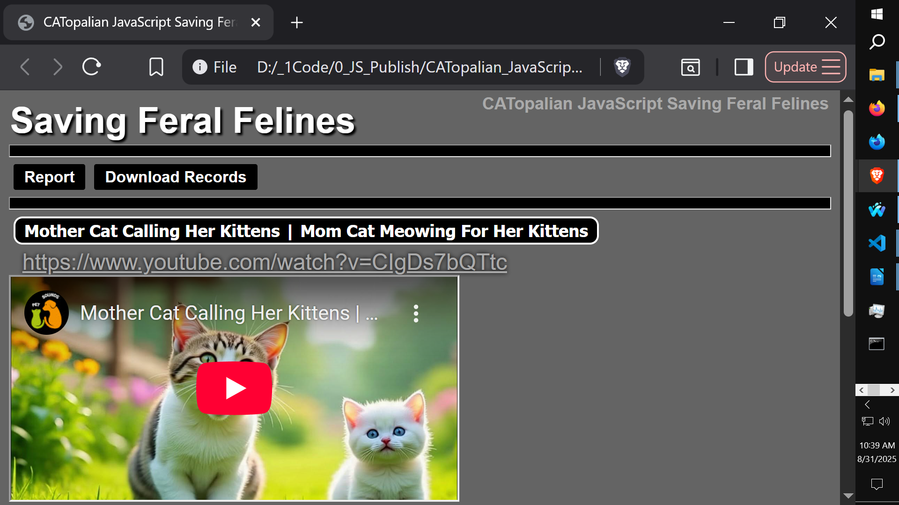

# CATopalian JavaScript Saving Feral Felines
Let's Help Save Feral Felines with JavaScript. This JS app displays videos from an array of objects in an orderly column with video data included.  The videos contain audio of Cat language. We use the Cat language audio to help rescuse feral felines.  

---

  

---

USE APP HERE: https://christopherandrewtopalian.github.io/CATopalian_JavaScript_Saving_Feral_Felines/CATopalian_JavaScript_Saving_Feral_Felines.html  

---

### How to Download this App
1. Click the green Code Button on this github page
2. Choose Download ZIP
3. Save the Zip File
4. Extract All
5. Double click the HTML file to start the App

---

Happy Scripting :-)

---

//----//

// Dedicated to God the Father  
// All Rights Reserved Christopher Andrew Topalian Copyright 2000-2025  
// https://github.com/ChristopherTopalian  
// https://github.com/ChristopherAndrewTopalian  
// https://sites.google.com/view/CollegeOfScripting

